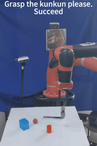

# 🎥 demo




## Preparation

Currently I have only provided the code for part of the structure. The complete code and video demo will be released after the acceptance notification.

Environment
   - use the environment.yml file to create the conda env.
   - conda install pytorch==2.4.1 torchvision==0.19.1 torchaudio==2.4.1  pytorch-cuda=11.8 -c pytorch -c nvidia

## Quick Start
run:

```
python -u traincrogtwinV010S8S16S32s4noshared_datatwin.py --config config/OCID-VLG/20240830swincrogV010S8S16S32S4noshared_datatwinr1.yaml
```

